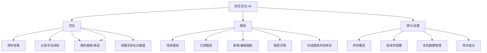

# 拼豆豆仓移动端 H5 产品需求文档

## 1. 产品概述

### 1.1 产品定位

「拼豆豆仓」是一款面向拼豆爱好者的移动端 H5 工具，用于管理不同颜色拼豆的库存、消耗和图纸制作记录。第一版聚焦个人本机使用，不需要登录、不依赖后端服务。

### 1.2 核心目标

- 快速查看每个颜色豆子的初始数量、补仓数量、已消耗数量和剩余数量。
- 基于项目内已有的 221 个拼豆色号表展示完整预置色卡。
- 支持首次批量初始化库存，并在后续盘点时按实际在仓数量修正差额。
- 支持记录手动消耗，便于修正零散使用情况。
- 支持一次为多个色号补仓，并在豆子详情直接修正实际在仓数量。
- 支持添加待拼图纸和已拼图纸。
- 支持为图纸记录用豆清单，并在图纸完成时自动扣减库存。
- 数据保存在本机浏览器中，刷新后不丢失。

### 1.3 目标用户

- 经常购买、整理和使用拼豆的个人用户。
- 有多色号拼豆库存，需要知道某个图纸是否够料的用户。
- 希望记录已完成作品和待拼清单的用户。

## 2. 信息架构



## 3. 全局产品线框图

### 3.1 底部导航结构

```text
┌──────────────────────────────┐
│            当前页面标题        │
├──────────────────────────────┤
│                              │
│                              │
│          页面主体内容          │
│                              │
│                              │
├──────────────────────────────┤
│  ● 豆仓     ○ 图纸     ○ 统计  │
└──────────────────────────────┘
```

### 3.2 全局交互规则

- 底部导航固定在页面底部，方便单手切换。
- 所有新增、编辑、确认类操作使用底部弹层或独立表单页。
- 数字输入默认使用手机数字键盘。
- 豆仓主视图以 3 列宫格展示色块，减少 221 个色号带来的页面长度。
- 豆仓右侧提供 A/B/C/D/E/F/G/H/M 字母索引条，可快速定位到对应色号分组。
- 预置色卡来自项目文件 `拼豆颜色.xlsx`，共 221 个有效编号，按表格分组顺序展示。
- 重要库存变化需要二次确认，避免误扣库存。
- 空状态提供明确入口，例如「还没有图纸，去添加」。
- 数据自动保存，不要求用户手动保存整页。

### 3.3 视觉设计规范

- 整体风格保持简约、干净、轻量，优先服务库存录入和快速查找。
- 页面主背景使用白色，弱分区背景使用浅米色。
- 主题色使用 `#8800B1`，仅用于强调位置。
- 主题色适用范围：主按钮、当前底部导航、当前标签、选中状态、关键数字强调、右侧字母索引当前项。
- 主题色不大面积铺底，不用于大块背景、普通卡片背景或装饰渐变。
- 卡片、表单、底部弹层以白色为主，使用浅灰/浅米色边框或分割线。
- 豆仓宫格中的颜色色块使用色号表真实 HEX 色值；库存文字和操作控件仍遵循简约白色/米色界面规范。
- 低库存提示可以使用轻量警示色，但面积要小，避免压过主题色。

## 4. 页面一：豆仓

### 4.1 页面目标

让用户快速掌握所有颜色豆子的库存情况，并能进行补仓和记录消耗。

### 4.2 页面线框图

```text
┌──────────────────────────────┐
│ 豆仓                  补仓  消耗 │
├──────────────────────────────┤
│ 搜索色号/颜色名                 │
├──────────────────────────────┤
│ 总剩余 12,480   低库存 6 色      │
├──────────────────────────────┤
│ A                            A│
│ ┌──────┐ ┌──────┐ ┌──────┐   B│
│ │ A1   │ │ A2   │ │ A3   │   C│
│ │余760 │ │余680 │ │余10  │   D│
│ └──────┘ └──────┘ └──────┘   E│
│ ┌──────┐ ┌──────┐ ┌──────┐   F│
│ │ A4   │ │ A5   │ │ A6   │   G│
│ │余420 │ │余980 │ │余300 │   H│
│ └──────┘ └──────┘ └──────┘   M│
├──────────────────────────────┤
│  ● 豆仓     ○ 图纸     ○ 统计  │
└──────────────────────────────┘
```

### 4.3 功能点

- 库存宫格：以 3 列色块宫格展示预置色卡中全部 221 个颜色编号。
- 搜索：支持按色号、颜色名搜索。
- 库存汇总：展示总剩余数量、低库存颜色数量。
- 单色库存信息：宫格卡片默认展示色块、色号、剩余数量；详情中展示初始数量、累计补仓、库存调整、手动消耗、图纸消耗和剩余数量。
- 低库存标识：剩余数量低于设置阈值时突出提示。
- 字母索引：右侧展示 A/B/C/D/E/F/G/H/M 快速定位条。
- 记录消耗：支持批量选择多个颜色，填写一个统一消耗数量并应用到全部已选颜色。
- 补仓：支持批量选择多个颜色，填写一个统一补仓数量并应用到全部已选颜色。
- 初始化库存：首次使用且尚无库存记录时，在豆仓显示初始化入口。

### 4.4 交互点

- 点击「消耗」进入空白批量消耗录入页。
- 点击「补仓」进入批量补仓录入页。
- 豆仓顶部不再提供单独的批量设置入口。
- 首次使用且尚无库存记录时，点击「初始化库存」批量录入各色号初始数量。
- 点击颜色卡片可查看库存明细、直接编辑在仓数量，并可从详情进入补仓或记录消耗。
- 长按颜色卡片可快速进入批量消耗录入页，并自动带入当前颜色。
- 点击右侧字母索引，页面滚动到对应分组首个色号。
- 拖动右侧字母索引时，跟随手指连续切换分组，并显示当前字母浮层。
- 搜索框输入后，宫格实时过滤；搜索状态下隐藏右侧字母索引。
- 批量消耗保存后，受影响颜色的剩余数量即时更新。
- 补仓或详情库存调整保存后，受影响颜色的剩余数量、总剩余和低库存状态即时更新。
- 库存初始化、库存盘点、批量消耗和批量补仓均支持按 A/B/C/D/E/F/G/H/M 字母组全选或取消整组。
- 当剩余数量可能为负数时，允许保存但显示明显提醒。

## 5. 页面二：初始化库存 / 库存盘点

### 5.1 页面目标

降低首次建仓和后续整体盘点的录入成本。首次使用时写入初始数量；已有库存数据时按盘点后的实际在仓数量生成差额调整记录。

### 5.2 页面线框图

```text
┌──────────────────────────────┐
│ ← 初始化库存 / 库存盘点     保存   │
├──────────────────────────────┤
│ 搜索色号/颜色名                 │
├──────────────────────────────┤
│ □ 全选色号                      │
│ ☑ [色块] A01 正红     [ 1000 ]  │
│ ☑ [色块] A02 天蓝     [  800 ]  │
│ □ [色块] A03 浅灰     [      ]  │
│ □ [色块] A04 黑色     [      ]  │
│ □ [色块] A05 白色     [      ]  │
├──────────────────────────────┤
│          保存修改              │
└──────────────────────────────┘
```

### 5.3 功能点

- 首次使用从豆仓空库存提示进入，已有库存后从统计页「库存盘点」进入。
- 按 `拼豆颜色.xlsx` 的色卡顺序展示全部颜色。
- 支持单选多个色号及全选/取消全选全部色号。
- 每个已选色号独立提供数量输入框。
- 支持搜索后只编辑部分颜色。
- 支持空值，空值按 0 处理。
- 初始化保存时写入所选色号的初始数量。
- 盘点保存时以目标在仓数量减去当前剩余数量，生成一条可追溯的库存调整记录，不覆盖初始数量和历史流水。
- 保存后返回来源页面并刷新库存。

### 5.4 交互点

- 数量输入框聚焦时弹出数字键盘。
- 点击「全选色号」选中全部 221 个色号；再次点击取消全选。
- 全选只控制色号选择，不统一填入数量；各色号数量仍由用户分别填写。
- 未选色号的数量输入框不可编辑，保存时只处理已选色号。
- 输入非法字符时自动拦截或提示。
- 若用户返回且存在未保存改动，提示是否放弃修改。

## 6. 页面三：批量记录消耗

### 6.1 页面目标

记录不属于某张图纸的零散消耗，例如试色、补件、损耗。用户可以一次选择多个颜色，填写一个统一消耗数量并同时应用到所有已选色号。

### 6.2 页面线框图

```text
┌──────────────────────────────┐
│ ← 记录消耗              保存   │
├──────────────────────────────┤
│ 搜索色号/颜色名                 │
├──────────────────────────────┤
│ 已选 3 色                      │
│ 每个颜色消耗数量         [200] │
│ [色块] A01 正红 剩余 760       │
│ [色块] A02 天蓝 剩余 680       │
│ [色块] H02 浅灰 剩余 410       │
├──────────────────────────────┤
│ 添加颜色                       │
│ [色块] A04 黑色       选择 +   │
│ [色块] A05 白色       选择 +   │
├──────────────────────────────┤
│ 备注                          │
│ [ 例如：补做钥匙扣 ]            │
├──────────────────────────────┤
│          保存消耗              │
└──────────────────────────────┘
```

### 6.3 功能点

- 支持一次选择多个颜色。
- 为所有已选颜色填写一个统一消耗数量。
- 支持点击 A/B/C/D/E/F/G/H/M，一次选择或取消对应字母组的全部色号。
- 支持从豆仓单个颜色的「记录消耗 +」进入，并自动预选该颜色。
- 支持搜索色号/颜色名后添加颜色。
- 支持移除已选颜色。
- 支持填写一条共同备注。
- 批量消耗保存后，所有明细进入库存计算。
- 保留批量消耗历史，便于后续追溯一次操作中的全部颜色。

### 6.4 交互点

- 未选择颜色时，保存按钮不可用。
- 统一消耗数量为 0 或空时，保存按钮不可用。
- 点击「选择 +」后，该颜色进入已选区域，输入框自动聚焦。
- 已选颜色再次出现在添加列表时显示已选状态，避免重复添加。
- 用户可以清空某行数量或移除颜色。
- 保存后返回豆仓页面，并刷新所有受影响颜色的剩余数量。
- 如果任一颜色消耗后剩余为负数，保存前提示具体颜色和负数结果，但允许继续保存。

### 6.5 批量补仓与在仓调整

```text
┌──────────────────────────────┐
│ ← 补仓                  保存   │
├──────────────────────────────┤
│ 已选 2 色                      │
│ 每个颜色补仓数量         [200] │
│ [色块] A01 当前 760            │
│ [色块] H02 当前 680            │
├──────────────────────────────┤
│ 添加颜色 / 搜索色号             │
├──────────────────────────────┤
│ 备注 [ 新购补豆 ]               │
├──────────────────────────────┤
│          保存补仓              │
└──────────────────────────────┘
```

- 批量补仓支持一次选择多个颜色，填写一个统一新增数量并应用到所有已选颜色。
- 批量补仓和批量消耗都支持按字母组快速全选或取消整组色号。
- 保存后生成一条补仓批次记录，各颜色的在仓数量即时增加。
- 豆子详情页提供「补仓」和「记录消耗」快捷入口。
- 豆子详情页可直接输入目标在仓数量；保存时按目标值与当前剩余的差额生成库存调整记录。
- 在仓数量增加时记录正调整，减少时记录负调整，不覆盖初始数量和既有消耗记录。
- 统计页展示累计补仓，并提供「补仓与调整记录」入口，可查看每次变更的色号、数量、时间和备注。

## 7. 页面四：图纸列表

### 7.1 页面目标

管理所有图纸，区分待拼和已拼，并快速新增图纸。

### 7.2 页面线框图

```text
┌──────────────────────────────┐
│ 图纸                       +  │
├──────────────────────────────┤
│ [ 待拼 ] [ 已拼 ]             │
├──────────────────────────────┤
│ ┌────────┐ 小狗挂件           │
│ │ 图片   │ 预计 12 色 / 860 颗 │
│ └────────┘ 创建 08-04         │
├──────────────────────────────┤
│ ┌────────┐ 樱桃杯垫           │
│ │ 图片   │ 预计 8 色 / 430 颗  │
│ └────────┘ 创建 08-02         │
├──────────────────────────────┤
│  ○ 豆仓     ● 图纸     ○ 统计  │
└──────────────────────────────┘
```

### 7.3 功能点

- 待拼列表：展示未完成图纸。
- 已拼列表：展示已完成图纸。
- 图纸卡片：展示封面图、名称、用色数量、用豆总数、创建/完成日期。
- 新增图纸：支持创建待拼或已拼图纸。
- 图纸详情入口：点击卡片进入详情。

### 7.4 交互点

- 点击顶部「+」进入新增图纸页面。
- 点击「待拼/已拼」切换列表。
- 点击图纸卡片进入详情。
- 列表为空时展示空状态和新增入口。
- 图纸图片加载失败时显示默认占位图。

## 8. 页面五：新增/编辑图纸

### 8.1 页面目标

录入图纸基础信息和用豆清单，为库存联动提供数据。

### 8.2 页面线框图

```text
┌──────────────────────────────┐
│ ← 新增图纸              保存   │
├──────────────────────────────┤
│ 封面图                        │
│ ┌──────────────────────────┐ │
│ │        上传/拍照          │ │
│ └──────────────────────────┘ │
│ 正在识别色号汇总  68%          │
│ [==========------]            │
├──────────────────────────────┤
│ 图纸名称                      │
│ [ 小狗挂件 ]                  │
├──────────────────────────────┤
│ 状态                          │
│ [ 待拼 ] [ 已拼 ]             │
├──────────────────────────────┤
│ 用豆清单                  添加 │
│ [色块] A01 正红 预计 [120] 实际 [ ]│
│ [色块] A02 天蓝 预计 [ 80] 实际 [ ]│
├──────────────────────────────┤
│ 备注                          │
│ [ 尺寸、来源、注意事项 ]        │
└──────────────────────────────┘
```

### 8.3 功能点

- 上传图片：支持从相册选择图纸或成品照片。
- 汇总区识别：上传待拼图纸后，仅识别图片中明确的“色号（数量）”汇总区，不逐格扫描或统计图纸网格。
- 识别确认：识别结果展示色号、数量和总颗数，支持逐项修改数量和删除错误项，确认后填入预计用豆清单。
- 本机处理：图片识别和色号校验均在当前浏览器本机完成，不上传图片或识别结果。
- 图纸名称：必填。
- 状态选择：待拼或已拼。
- 用豆清单：选择颜色并填写预计数量、实际数量。
- 备注：记录尺寸、来源、制作注意事项等。
- 编辑图纸：支持修改图纸信息和用豆清单。

### 8.4 交互点

- 点击上传区域选择图片。
- 图片上传后自动开始识别，并展示识别进度；识别过程中不阻塞其他表单内容填写。
- 找到汇总区时弹出确认窗口，用户确认后才写入用豆清单；已有同色号按识别数量更新，其他已填颜色保留。
- 未找到明确汇总区或识别失败时提示手动填写，不回退到逐格识别。
- 识别结果可能受图片清晰度、字号和深浅色标签影响，用户必须核对；漏识别色号可继续在用豆清单中手动添加。
- 支持对当前原图重新识别，也可移除或更换图片。
- 点击「添加」打开颜色选择器。
- 颜色选择器支持搜索色号/颜色名。
- 待拼图纸默认只要求填写预计数量。
- 已拼图纸要求填写实际数量；若实际数量为空，可默认使用预计数量。
- 保存时校验图纸名称不能为空。
- 保存已拼图纸后，其实际用豆量参与库存扣减。
- 识别并填入待拼图纸的预计用量不会扣减库存，只有图纸完成后的实际用量参与扣减。

## 9. 页面六：图纸详情

### 9.1 页面目标

查看图纸详情，完成待拼图纸，并查看该图纸对库存的影响。

### 9.2 页面线框图

```text
┌──────────────────────────────┐
│ ← 图纸详情              编辑   │
├──────────────────────────────┤
│ ┌──────────────────────────┐ │
│ │          图纸图片         │ │
│ └──────────────────────────┘ │
├──────────────────────────────┤
│ 小狗挂件              待拼      │
│ 创建：2026-08-04              │
├──────────────────────────────┤
│ 用豆清单                      │
│ [色块] A01 正红 预计 120 剩余 760│
│ [色块] A02 天蓝 预计 80  剩余 680│
│ [色块] A03 浅灰 预计 40  剩余 10 │
├──────────────────────────────┤
│ 备注：适合做钥匙扣              │
├──────────────────────────────┤
│          标记为已完成           │
│           删除图纸              │
└──────────────────────────────┘
```

### 9.3 功能点

- 查看图纸图片、名称、状态、日期、备注。
- 查看用豆清单。
- 对待拼图纸展示预计需求和当前库存。
- 对已拼图纸展示实际消耗和完成日期。
- 支持编辑图纸。
- 支持将待拼图纸标记完成。
- 支持在图纸详情页删除当前图纸。

### 9.4 交互点

- 点击图片可全屏预览。
- 点击编辑进入编辑页面。
- 点击详情页删除按钮后进行二次确认。
- 删除待拼图纸仅删除图纸记录；删除已拼图纸同时撤销该图纸对库存的消耗影响。
- 点击「标记为已完成」进入完成确认流程。
- 如果预计需求超过当前库存，颜色行显示不足提示。
- 已完成图纸不重复扣库存；编辑实际用量后按最新数据重新计算。

## 10. 页面七：完成图纸确认

### 10.1 页面目标

在扣减库存前确认实际用豆量，避免误扣。

### 10.2 页面线框图

```text
┌──────────────────────────────┐
│ 完成图纸                      │
├──────────────────────────────┤
│ 小狗挂件                      │
│ 将按以下实际用量计入消耗        │
├──────────────────────────────┤
│ [色块] A01 正红 预计 120 实际 [120]│
│ [色块] A02 天蓝 预计 80  实际 [ 78]│
│ [色块] A03 浅灰 预计 40  实际 [ 42]│
├──────────────────────────────┤
│ 完成日期                      │
│ [ 2026-08-04 ]                │
├──────────────────────────────┤
│       取消        确认完成      │
└──────────────────────────────┘
```

### 10.3 功能点

- 展示该图纸所有用豆颜色。
- 实际数量默认带入预计数量。
- 支持修改实际数量。
- 保存完成日期。
- 确认后状态变为已拼，并扣减库存。

### 10.4 交互点

- 实际数量可逐项编辑。
- 点击确认前检查是否存在库存不足。
- 库存不足时提示用户，但允许继续确认。
- 确认后回到图纸详情，并显示已拼状态。

## 11. 页面八：统计/设置

### 11.1 页面目标

提供整体库存概览和基础数据管理能力。

### 11.2 页面线框图

```text
┌──────────────────────────────┐
│ 统计/设置                     │
├──────────────────────────────┤
│ 库存概览                      │
│ 总初始 20,000                 │
│ 总消耗 7,520                  │
│ 总剩余 12,480                 │
├──────────────────────────────┤
│ 低库存颜色                    │
│ [色块] A03 浅灰 剩余 10        │
│ [色块] A11 米白 剩余 18        │
├──────────────────────────────┤
│ 库存与设置                    │
│ 库存盘点                    > │
│ 低库存阈值 [ 50 ]              │
│ 消耗历史                    >  │
│ 补仓与调整记录              >  │
│ 清空本机数据                   │
├──────────────────────────────┤
│  ○ 豆仓     ○ 图纸     ● 统计  │
└──────────────────────────────┘
```

### 11.3 功能点

- 库存概览：总初始、总消耗、总剩余。
- 低库存列表：展示低于阈值的颜色。
- 库存盘点入口：批量填写盘点后的实际在仓数量，并按差额生成调整记录。
- 阈值设置：用户可设置低库存判断标准。
- 消耗历史入口：进入批量消耗历史列表，查看每次操作及其颜色明细。
- 补仓与调整记录入口：查看补仓、详情修正和库存盘点产生的记录。
- 清空数据：清空本机库存、消耗和图纸数据。

### 11.4 交互点

- 修改低库存阈值后立即影响豆仓和统计页展示。
- 点击低库存颜色可跳转到豆仓对应颜色。
- 点击「库存盘点」进入批量盘点页面，返回后保留统计页状态。
- 点击「消耗历史」进入消耗历史列表。
- 点击清空数据需要二次确认。
- 清空后回到初始空数据状态。

### 11.5 消耗历史子页面

```text
┌──────────────────────────────┐
│ ← 消耗历史                    │
├──────────────────────────────┤
│ 2026-08-04  补做钥匙扣          │
│ 3 色 / 共 92 颗              > │
├──────────────────────────────┤
│ 2026-08-02  试色               │
│ 2 色 / 共 15 颗              > │
└──────────────────────────────┘
```

#### 功能点

- 按创建时间倒序展示批量消耗记录。
- 每条记录展示日期、备注、涉及颜色数量和消耗总数。
- 点击记录可展开或进入详情，查看该批次内所有色号及各自消耗数量。
- 第一版仅支持查看，不支持编辑或删除消耗历史。

#### 交互点

- 从统计/设置页进入，返回后保留统计页原有状态。
- 无消耗记录时展示空状态，并提供前往豆仓记录消耗的入口。
- 色号明细展示真实色块、色号和消耗数量。

## 12. 核心业务规则

### 12.1 库存计算

```text
颜色剩余数量 = 初始数量 + 累计补仓 + 库存调整 - 手动消耗数量 - 已完成图纸实际用豆数量
```

- 待拼图纸的预计用豆不扣库存。
- 已完成图纸的实际用豆参与扣库存。
- 一次批量消耗记录可以包含多个颜色明细，每个颜色明细分别计入对应颜色的手动消耗。
- 一次批量补仓记录可以包含多个颜色明细，每个颜色明细分别增加对应颜色的库存。
- 直接编辑在仓数量不会重写初始库存，而是生成一条可追溯的正数或负数库存调整。
- 编辑已完成图纸的实际用豆后，库存按最新数据重新计算。
- 删除已完成图纸后，该图纸造成的消耗不再计入库存。

### 12.2 图纸状态

- 待拼：用于计划制作，记录预计用豆。
- 已拼：表示作品完成，记录实际用豆并扣库存。
- 待拼改为已拼时，需要走完成确认。
- 已拼改回待拼时，需要提示库存消耗会被撤销。

### 12.3 图片规则

- 图纸图片保存在本机浏览器。
- 单张图片建议压缩后保存，避免占用过多本机空间。
- 图片不是必填，但无图时使用默认占位。

### 12.4 色卡规则

- 预置色卡来源为 `拼豆颜色.xlsx`。
- 表格包含 `ABC`、`DEF`、`GHM` 三个工作表。
- 有效色号数量为 221 个，编号唯一。
- 每个颜色至少包含色号编号和 HEX 色值。
- 如果表格中提供批量初始数量，则首次建仓时可作为默认初始数量带入。
- 用户不能在第一版中新增或删除色号，只能修改每个色号的库存数量。

## 13. 数据结构草案

```ts
type BeadColor = {
  id: string;
  code: string;
  name?: string;
  hex: string;
  group: "ABC" | "DEF" | "GHM";
  defaultInitialQuantity?: number;
};

type InventoryItem = {
  colorId: string;
  initialQuantity: number;
};

type ConsumptionEntry = {
  id: string;
  items: ConsumptionItem[];
  note?: string;
  createdAt: string;
};

type ConsumptionItem = {
  colorId: string;
  quantity: number;
};

type PatternUsage = {
  colorId: string;
  expectedQuantity: number;
  actualQuantity?: number;
};

type Pattern = {
  id: string;
  name: string;
  status: "todo" | "done";
  imageDataUrl?: string;
  usages: PatternUsage[];
  note?: string;
  createdAt: string;
  completedAt?: string;
};
```

## 14. 验收标准

- 系统可以从项目内色号表加载 221 个唯一颜色编号。
- 豆仓页面以一行 3 个色块的宫格展示 221 个颜色编号。
- 用户可以通过右侧 A/B/C/D/E/F/G/H/M 索引条快速定位色号分组。
- 用户可以在手机浏览器中完成首次建仓。
- 首次使用且无库存记录时，豆仓显示初始化库存入口。
- 用户可以全选全部色号进行库存初始化或盘点，各色号数量分别填写。
- 已有库存数据时，库存盘点按目标在仓数量生成差额调整记录，不覆盖初始数量和历史流水。
- 用户可以一次选择多个颜色并填写统一数量，批量记录每个颜色相同的手动消耗。
- 用户可以一次选择多个颜色并填写统一数量，批量为每个颜色增加相同库存。
- 用户可以按 A/B/C/D/E/F/G/H/M 字母范围全选或取消对应组的所有色号。
- 用户可以在豆子详情直接修改目标在仓数量，并立即得到准确剩余数量。
- 用户可以从统计页查看补仓和库存调整历史。
- 用户可以从统计页查看每次批量消耗及其颜色明细。
- 用户从某个颜色进入记录消耗时，该颜色会自动带入批量消耗表单。
- 用户可以添加待拼图纸并填写预计用豆清单。
- 上传含明确汇总区的待拼图纸后，可以识别色号及数量、人工修改并确认填入预计用豆清单。
- 图片没有明确汇总区时，系统提示手动填写且不会逐格统计。
- 待拼图纸不会改变库存剩余数量。
- 用户将图纸标记为已完成后，实际用豆自动计入库存消耗。
- 用户可以查看待拼和已拼图纸列表。
- 用户可以在图纸详情页删除图纸；删除已拼图纸后库存正确恢复。
- 用户刷新页面后，库存和图纸数据仍存在。
- 页面整体以白色/米色为主，`#8800B1` 只出现在主按钮、选中状态和关键强调位置。
- 页面在常见手机宽度下不出现文字重叠、按钮溢出或无法点击的问题。

## 15. 第一版暂不包含

- 登录注册。
- 云端同步。
- 多人协作。
- 真实订单或采购管理。
- 逐格识别并统计图纸网格中的颜色数量。
- 多品牌色卡切换。
- 图纸分享社区。
- 数据导入和导出。
